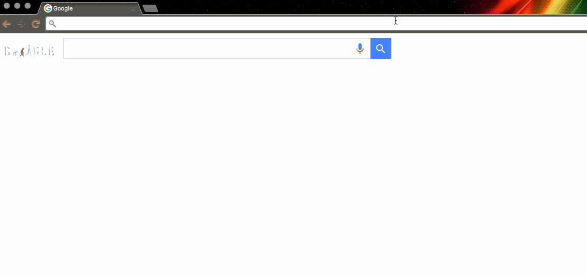

# stov 

stov is a Chrome extension that allows users to search Stack Overflow by making use of the Omnibox API. Its goal is to make the process of searching Stack Overflow easy without interupting workflow.

## Install

1. Clone this repository
2. Open Chrome
3. Go to More Tools -> Extensions -> Load Unpacked Extension
4. Select the repository folder

## Usage

` stov [search] `

Using stov is very easy. In the Chrome search bar, type ` stov` followed by a space or tab, and then enter your search criteria.